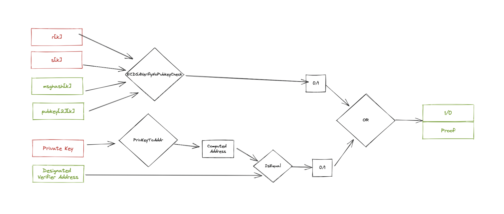

# Designated Verifier Proof

We have individual minimal disclosure. Designated Verifier Proofs (DVPs) enable collective minimal disclosure. In doing so, we can maintain the integrity of information within a set of selected agents. This repository is designed to enable people to build DVPs into their social applications and can be done both on- and off-chain. It is designed to be compatible for EVM based applications. 

Paper on DVPs to be released soon. 

Core Team: Enrico Bottazzi (Developer) and Shrey Jain (Researcher and PM)

Enrico Bottazzi is a ZK Developer and Writer at Polygon ID and Shrey Jain is a Web3 Researcher at Microsoft.

_________________________________________________________________________________________________

Designated Verifier Proof is a type of proof that can only be verified by a specific subject. For this example we used a proof of valid ECDSA signature. 

DVP uses Zero Knowledge Proof to achieve that!

- The prover chooses the designated verifier
- The prover signs the message to be shared with the designated verifier 
- The prover generates a proof that the signature is valid (1st condition) **OR** he/she knows the private key of the designated verifier (2nd condition)
- The verifier receives the proof

After the verifier receives the proof, he/she can potentially share it with third parties. But here's the cool thing:
No one, except for the designated verifier, can tell if the proof verifies because of the 1st condition or the 2nd condition, i.e. because it has been forged by the designated verifier.

Idea inspired by: 

- [Jordi Baylina - ZKP and SSI - Iden3](https://www.youtube.com/watch?v=Rd6SMShk7-c&t=998s)
- [Markus Jakobsson - Designated Verifier Proofs and Their Applications paper](http://markus-jakobsson.com/papers/jakobsson-eurocrypt96.pdf)

## Circuit Design 

The design of the circuit relies on two main components: 

- [0xPARC `ECDSAVerifyNoPubkeyCheck`](https://github.com/0xPARC/circom-ecdsa/blob/master/circuits/ecdsa.circom#L129): Given a signature (r, s), a message hash, and a secp256k1 public key, it follows ecdsa verification algorithm to extract r' from s, message hash and public key, and then compares r' with r to see if the signaure is correct. The output result is 1 if r' and r are equal, 0 otherwise.
- [0xPARC `ECDSAPrivToPub`](https://github.com/0xPARC/circom-ecdsa/blob/master/circuits/ecdsa.circom#L14): Given a secp256k1 private key, outputs the corresponding public key by computing (private_key) * G where G is the base point of secp256k1.

The circuit [`DesignatedVerifierProof`](./circuits/lib/designated-verifier-proof.circom) meshes these two circuits together to verify 2 conditions: 

- Is the signature actually been performed by that `pubkey`?
- Does the private key match the `Designated Verifier Address`? 

Each of these conditions generates an intermediate signal => 1 if verifier and 0 if not verified. These two signals are eventually passed into a `OR` verification that generates the single public output of the circuit: 1 if at least one of the condition verifies or 0 if none of the condition verifies.

<div align="center">

</div>

## Designated Verifier Proof in Practice

The essence of the DVP is based on a simple yet very powerful concept. Let's consider an example: Alice signs a message X and passes it to Bob (not using a DVP). In this scenario Bob is able to check that the signature is valid and it actually comes from Alice. Bob can now share this proof with third parties and *anyone will be persuaded* by the fact "Alice signed message X".

Using DVP, Alice generates a proof that the signature of message X is valid *OR* that she knows the private key of the designated verifier. This proof is passed to Bob. Bob is aware that his private key hasn't been compromised by Alice, therefore he knows that the proof must be valid because the signature is valid. 

What if Bob wants to persuade other people that "Alice signed message X"? He can still share the proof received by Alice with third parties but they wouldn't know whether: 

- The proof verifies because the signature is valid
- The proof verifies because the verifier knows his own private key (which is true by definition)

With DVP *only the Designated Verifier will be persuaded* by the signature provided by the Prover.

## Setup 

- Install package dependencies `npm i`
- Clone submodule from root directory `git submodule update --init`
- Install sub module dependencies `cd circom-ecdsa / npm i`
- Download ptau inside circuits folder `cd circuits / wget https://hermez.s3-eu-west-1.amazonaws.com/powersOfTau28_hez_final_21.ptau`

## Test 

- `export NODE_OPTIONS=--max-old-space-size=120480000` to specifies the amount of virtual memory allocated to Node.js in order to avoid Javascript running out of memory
- `mocha`

Note; in order to successfully test it a patch to circom_tester must be applied:

Comment out line 90 and 91 inside `node_modules/circom_tester/wasm/tester.js`. These avoids breaking the circom_tester compiler due to warnings included in the circuit compilation.

```js
// assert(b.stderr == "",
//   "circom compiler error \n" + b.stderr);
```

## Machine setup to build

To interact with such large circuits, it is needed to operate with very large machines and set a few tweaks to make it possible:

- [Set up your instance](https://hackmd.io/V-7Aal05Tiy-ozmzTGBYPA?view#Setup-from-scratch)
- [Remove system memory limit](https://hackmd.io/V-7Aal05Tiy-ozmzTGBYPA?view#Remove-system-memory-limit)
- [Install Snarkjs](https://docs.circom.io/getting-started/installation/#installing-snarkjs)
- Clone the repo and follow the setup previously described
- `export NODE_OPTIONS=--max-old-space-size=120480000` 
- To build `bash scripts/build_dvp.sh`

I used a AWS c3.8xlarge instance to build this. This instance has 32vCPU, 60GB of RAM and 30 GB of SSD Memory. The instance will use Ubuntu 20.04. It costs $1.6/hour to run.

The circuit specified in this repo has 1756287 constraints.

## Benchmarks

All benchmarks were run on the AWS c3.8xlarge machine previously described.

|   |dvp|
|---|---|
|Constraints                          |1756287 |
|Circuit compilation                  |153s    |
|Witness generation                   |232s     |
|Trusted setup phase 2 key generation |722s     |
|Trusted setup phase 2 contribution   |104s      |
|Proving key size                     |1.2G     |
|Proving key verification             |787s     |
|Proving time                         |66s      |
|Proof verification time              |1s      |

The most intense step is the proving key generation. Luckily, this process need to be executed only once and can be reused for every application that wants to use this circuit architecture. 

The artifacts generated during the Trusted Setup are publicly awailable:

- proving key **zkey** `wget https://dvs-eb-bucket.s3.eu-west-2.amazonaws.com/dvs.zkey` 
- circuit **wasm** `wget  https://dvs-eb-bucket.s3.eu-west-2.amazonaws.com/dvs.wasm`
- verification key **vkey** `wget https://dvs-eb-bucket.s3.eu-west-2.amazonaws.com/vkey.json`

Users will only need these artifact in order to generate/verify proofs. These processes are much less light weight and can be executed locally inside any browser.
